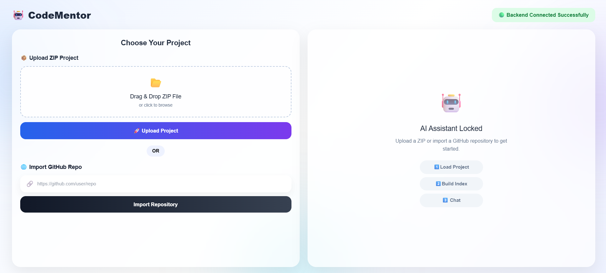
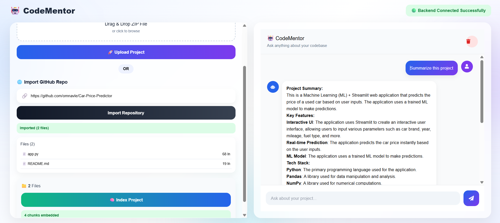

# AI Code Mentor

An AI-powered code understanding assistant that enables developers to upload a ZIP project or import a public GitHub repository and interact with the codebase using natural language. The application leverages Retrieval-Augmented Generation (RAG) to provide context-aware answers about source code, architecture, functions, and implementation details.

Built with **React**, **FastAPI**, **LangChain**, **ChromaDB**, and **Groq/OpenAI**, the project demonstrates modern AI engineering practices, semantic code search, vector databases, and LLM integration.

---

## Features

- Upload a ZIP project for analysis
- Import public GitHub repositories
- Automatic source code indexing
- Semantic code search using embeddings
- Retrieval-Augmented Generation (RAG)
- AI-powered code explanations
- Context-aware question answering
- Persistent vector storage with ChromaDB
- Responsive React interface
- FastAPI backend

---

## Tech Stack

### Frontend

- React
- Vite
- Axios
- CSS

### Backend

- FastAPI
- Python
- Uvicorn

### AI Framework

- LangChain

### LLM

- Groq API 

### Vector Database

- ChromaDB

### Embeddings

- HuggingFace Embeddings
- all-MiniLM-L6-v2

### Repository Processing

- GitPython

---

# How It Works

1. Upload a ZIP project or import a public GitHub repository.
2. The backend extracts and processes source files.
3. LangChain splits the code into semantic chunks.
4. HuggingFace Embeddings generate vector representations.
5. ChromaDB stores the embeddings.
6. User questions are converted into embedding vectors.
7. Relevant code chunks are retrieved from ChromaDB.
8. Retrieved context is sent to the LLM.
9. The AI generates an accurate answer based on the project code.

---

# Installation

## Clone Repository

```bash
git clone https://github.com/yourusername/AI-Code-Mentor.git

cd AI-Code-Mentor
```

---

# Backend Setup

```bash
cd backend

python -m venv venv

venv\Scripts\activate
```

Install dependencies

```bash
pip install -r requirements.txt
```

---

# Environment Variables

Create a `.env` file inside the backend folder.

```env
GROQ_API_KEY=your_groq_api_key
```

---

# Start Backend

```bash
uvicorn main:app --reload
```

Backend URL

```
http://localhost:8000
```

---

# Frontend Setup

```bash
cd frontend

npm install

npm run dev
```

Frontend URL

```
http://localhost:5173
```

---

# Screenshots

## Project Upload



---

## AI Chat Interface


